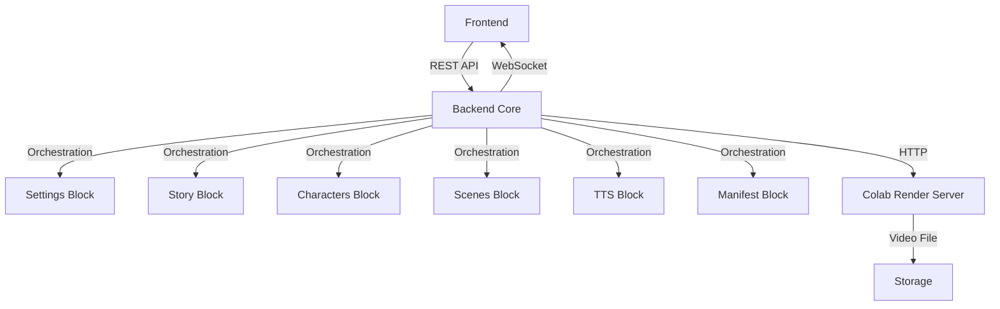

# AI Video Generation Platform — Паспорт Проекта

## 📖 Оглавление

1. [Общая информация](#общая-информация)
2. [Архитектура системы](#архитектура-системы)
3. [Структура проекта](#структура-проекта)
4. [Установка и запуск](#установка-и-запуск)
5. [API Reference](#api-reference)
6. [WebSocket Events](#websocket-events)
7. [Сценарии использования](#сценарии-использования)
8. [Blueprints всех блоков](#blueprints-всех-блоков)

---

## 🌟 Общая информация

**Название:** AI Video Generation Platform  
**Версия:** 1.0.0  
**Тип:** Modular Backend System для генерации видео с помощью AI  
**Основной стек:** Python 3.12+, FastAPI, Pydantic, asyncio, WebSocket  

### Назначение
Платформа автоматизирует создание коротких видео (60 сек) из текстовой идеи:
- Генерация истории и сценария
- Создание персонажей с визуальной консистентностью
- Разбиение на сцены с motion и transitions
- TTS озвучка с синхронизацией
- Подготовка manifest для рендеринга
- Управление удалённым Colab render server

### Ключевые принципы
- **Модульность:** Каждый блок независим
- **Разделение ответственности:** Backend = оркестратор, Colab = рендер
- **Realtime:** WebSocket обновления прогресса
- **Масштабируемость:** Очередь задач, retry logic

---

## 🏗 Архитектура системы



### Блоки системы

| Блок | Название | Ответственность |
|------|----------|-----------------|
| **Блок 0** | Backend Server Core | Оркестрация, API, Jobs, WebSocket |
| **Блок 2** | Settings + Prompts | Конфигурации, промпты, версии, каналы |
| **Блок 3** | Story + Script | Генерация истории, адаптация, сценарий |
| **Блок 4** | Character System | Персонажи, референсы, консистентность |
| **Блок 5** | Scene System | Сцены, visual prompts, motion, transitions |
| **Блок 6** | TTS + Sync | Озвучка, тайминги, субтитры |
| **Блок 7** | Manifest + Render Prep | Сборка manifest, ffmpeg инструкции |
| **Блок 8** | Render Integration | Colab client, upload, download, статус |

---

## 📁 Структура проекта

```text
backend/
│
├── main.py                          # Точка входа (uvicorn)
├── app.py                           # Фабрика FastAPI приложения
│
├── core/
│   ├── config.py                    # Конфигурация и env variables
│   ├── logger.py                    # Логирование
│   ├── exceptions.py                # Кастомные исключения
│   ├── dependencies.py              # DI контейнер
│   └── lifecycle.py                 # Startup/shutdown hooks
│
├── api/
│   ├── routes/
│   │   ├── projects.py              # CRUD проектов
│   │   ├── jobs.py                  # Управление задачами
│   │   ├── pipeline.py              # Контроль этапов
│   │   ├── prompts.py               # Управление промптами
│   │   ├── settings.py              # Настройки системы
│   │   ├── render.py                # Render управление
│   │   └── health.py                # Health checks
│   │
│   ├── websocket/
│   │   ├── manager.py               # WebSocket менеджер
│   │   └── events.py                # Event types
│   │
│   └── schemas/
│       ├── project_schema.py        # Pydantic модели проектов
│       ├── job_schema.py            # Pydantic модели задач
│       ├── pipeline_schema.py       # Pydantic модели пайплайна
│       └── settings_schema.py       # Pydantic модели настроек
│
├── orchestration/
│   ├── pipeline_manager.py          # Главный оркестратор
│   ├── stage_runner.py              # Запуск отдельных stages
│   ├── queue_manager.py             # Очередь задач
│   ├── job_manager.py               # Менеджер состояний jobs
│   ├── retry_manager.py             # Retry логика
│   └── event_dispatcher.py          # Рассылка событий
│
├── storage/                         # Директории для данных
│   ├── prompts/
│   ├── outputs/
│   ├── temp/
│   ├── logs/
│   └── cache/
│
├── shared/
│   ├── models/
│   ├── utils/
│   ├── constants/
│   └── enums/
│
├── settings/                        # БЛОК 2
│   ├── settings_manager.py
│   ├── prompt_manager.py
│   ├── template_engine.py
│   ├── channel_manager.py
│   ├── provider_config.py
│   ├── variable_resolver.py
│   ├── prompt_versioning.py
│   └── settings_schema.py
│
├── story/                           # БЛОК 3
│   ├── story_generator.py
│   ├── story_adapter.py
│   ├── script_builder.py
│   ├── scene_splitter.py
│   ├── narrative_parser.py
│   ├── style_extractor.py
│   └── story_schema.py
│
├── characters/                      # БЛОК 4
│   ├── character_extractor.py
│   ├── character_builder.py
│   ├── prompt_builder.py
│   ├── reference_generator.py
│   ├── consistency_manager.py
│   ├── character_schema.py
│   └── style_normalizer.py
│
├── scenes/                          # БЛОК 5
│   ├── scene_builder.py
│   ├── scene_splitter.py
│   ├── prompt_builder.py
│   ├── motion_generator.py
│   ├── transition_builder.py
│   ├── scene_schema.py
│   └── timing_estimator.py
│
├── tts/                             # БЛОК 6
│   ├── tts_generator.py
│   ├── audio_splitter.py
│   ├── audio_analyzer.py
│   ├── subtitle_generator.py
│   ├── timing_sync.py
│   ├── scene_audio_mapper.py
│   └── tts_schema.py
│
├── manifest/                        # БЛОК 7
│   ├── manifest_builder.py
│   ├── timeline_calculator.py
│   ├── transition_mapper.py
│   ├── ffmpeg_instruction_builder.py
│   ├── render_schema.py
│   └── export_packager.py
│
├── render/                          # БЛОК 8
│   ├── colab_client.py
│   ├── render_manager.py
│   ├── job_tracker.py
│   ├── upload_manager.py
│   ├── result_downloader.py
│   ├── server_health.py
│   └── render_schema.py
│
└── tests/                           # Тесты
```

---

## ⚙️ Установка и запуск

### Требования
- Python 3.12+
- Linux (протестировано на Linux Mint)
- VS Code (рекомендуется)

### Шаг 1: Клонирование и навигация
```bash
cd /workspace
```

### Шаг 2: Создание виртуального окружения
```bash
python3 -m venv venv
source venv/bin/activate
```

### Шаг 3: Установка зависимостей
Создайте файл `requirements.txt`:
```text
fastapi>=0.109.0
uvicorn[standard]>=0.27.0
pydantic>=2.5.0
pydantic-settings>=2.1.0
python-dateutil>=2.8.0
httpx[http2]>=0.26.0
requests>=2.31.0
aiofiles>=23.2.0
aioshutil>=1.4.0
uuid6>=2024.1.12
tenacity>=8.2.0
mutagen>=1.47.0
websockets>=12.0
python-multipart>=0.0.6
```

Установка:
```bash
pip install --upgrade pip
pip install -r requirements.txt
```

### Шаг 4: Создание __init__.py файлов
```bash
find backend -type d -exec touch {}/__init__.py \;
```

### Шаг 5: Настройка переменных окружения
Создайте файл `.env` в корне `backend/`:
```bash
# AI Provider
AI_PROVIDER=openai
AI_MODEL=gpt-4-turbo
OPENAI_API_KEY=your_api_key_here
YANDEX_FOLDER_ID=null

# Colab Render Server
COLAB_URL=http://localhost:8080

# Server Settings
HOST=0.0.0.0
PORT=8000
DEBUG=true

# Storage
STORAGE_PATH=./storage
```

### Шаг 6: Запуск сервера
```bash
cd backend
python main.py
```

Или напрямую через uvicorn:
```bash
uvicorn backend.main:app --host 0.0.0.0 --port 8000 --reload
```

### Шаг 7: Проверка работы
Откройте браузер:
- API Docs: http://localhost:8000/docs
- Health Check: http://localhost:8000/api/health

### Остановка сервера
```bash
# В терминале где запущен сервер
Ctrl+C

# Деактивация venv
deactivate
```

---

## 📡 API Reference

### Base URL
```
http://localhost:8000/api
```

### Общие форматы ответов

**Успех (200 OK):**
```json
{
  "status": "success",
  "data": { ... },
  "message": "Operation completed"
}
```

**Ошибка (4xx/5xx):**
```json
{
  "status": "error",
  "code": "ERROR_CODE",
  "message": "Human readable message",
  "details": { ... }
}
```

---

### 1. Health Endpoints

#### GET /health
Проверка общего состояния сервиса.

**Response:**
```json
{
  "status": "healthy",
  "service": "ai-video-platform",
  "version": "1.0.0",
  "timestamp": "2024-01-15T10:30:00Z"
}
```

#### GET /health/colab
Проверка подключения к Colab серверу.

**Response:**
```json
{
  "colab_status": "online",
  "url": "http://colab-server:8080",
  "latency_ms": 45
}
```

#### GET /health/pipeline
Проверка доступности всех модулей пайплайна.

**Response:**
```json
{
  "pipeline_status": "ready",
  "modules": {
    "settings": "ok",
    "story": "ok",
    "characters": "ok",
    "scenes": "ok",
    "tts": "ok",
    "manifest": "ok",
    "render": "ok"
  }
}
```

---

### 2. Projects Endpoints

#### GET /projects
Получить список всех проектов.

**Query Parameters:**
- `limit` (int, default: 20)
- `offset` (int, default: 0)

**Response:**
```json
{
  "projects": [
    {
      "project_id": "proj_123",
      "name": "My First Video",
      "created_at": "2024-01-15T10:00:00Z",
      "jobs_count": 3
    }
  ],
  "total": 1
}
```

#### POST /projects
Создать новый проект.

**Request Body:**
```json
{
  "name": "Horror Stories Channel",
  "description": "Short horror stories for YouTube Shorts",
  "default_settings_id": "settings_456"
}
```

**Response:**
```json
{
  "project_id": "proj_123",
  "name": "Horror Stories Channel",
  "created_at": "2024-01-15T10:00:00Z",
  "status": "active"
}
```

#### GET /projects/{project_id}
Получить детали проекта.

**Response:**
```json
{
  "project_id": "proj_123",
  "name": "Horror Stories Channel",
  "description": "...",
  "settings": { ... },
  "channels": [ ... ],
  "recent_jobs": [ ... ]
}
```

#### DELETE /projects/{project_id}
Удалить проект.

**Response:**
```json
{
  "status": "deleted",
  "project_id": "proj_123"
}
```

---

### 3. Jobs Endpoints

#### GET /jobs
Получить список задач.

**Query Parameters:**
- `project_id` (string, optional)
- `status` (string, optional: queued|running|completed|failed)
- `limit` (int, default: 20)

**Response:**
```json
{
  "jobs": [
    {
      "job_id": "job_789",
      "project_id": "proj_123",
      "status": "running",
      "current_stage": "scene_generation",
      "progress": 65.5,
      "created_at": "2024-01-15T10:30:00Z",
      "updated_at": "2024-01-15T10:35:00Z"
    }
  ],
  "total": 1
}
```

#### GET /jobs/{job_id}
Получить детали задачи.

**Response:**
```json
{
  "job_id": "job_789",
  "project_id": "proj_123",
  "status": "running",
  "current_stage": "scene_generation",
  "progress": 65.5,
  "stages_completed": [
    "story_generation",
    "character_extraction",
    "story_adaptation"
  ],
  "logs": [
    "2024-01-15T10:30:00Z - Job started",
    "2024-01-15T10:31:00Z - Story generated successfully"
  ],
  "errors": []
}
```

#### POST /jobs/start
Запустить новую задачу генерации.

**Request Body:**
```json
{
  "project_id": "proj_123",
  "idea": "A lonely astronaut discovers an ancient alien signal",
  "genre": "sci-fi",
  "style": "cinematic dark",
  "duration": 60,
  "orientation": "vertical",
  "channel_id": "channel_001"
}
```

**Response:**
```json
{
  "job_id": "job_789",
  "status": "queued",
  "message": "Job added to queue",
  "estimated_start_time": "2024-01-15T10:30:05Z"
}
```

#### POST /jobs/{job_id}/stop
Остановить выполняющуюся задачу.

**Response:**
```json
{
  "job_id": "job_789",
  "status": "stopped",
  "stopped_at": "2024-01-15T10:35:00Z",
  "completed_stages": ["story_generation"]
}
```

#### POST /jobs/{job_id}/retry
Повторить неудачную задачу.

**Request Body:**
```json
{
  "from_stage": "tts_generation" 
}
```

**Response:**
```json
{
  "job_id": "job_789",
  "status": "queued",
  "retry_count": 1,
  "from_stage": "tts_generation"
}
```

---

### 4. Pipeline Endpoints

#### POST /pipeline/run
Запустить полный пайплайн для задачи.

**Request Body:**
```json
{
  "job_id": "job_789",
  "skip_stages": [],
  "dry_run": false
}
```

**Response:**
```json
{
  "job_id": "job_789",
  "status": "running",
  "current_stage": "story_generation",
  "stages_queue": [
    "story_generation",
    "character_extraction",
    "story_adaptation",
    "scene_generation",
    "tts_generation",
    "manifest_creation",
    "render_submit"
  ]
}
```

#### POST /pipeline/run-stage
Запустить конкретный этап.

**Request Body:**
```json
{
  "job_id": "job_789",
  "stage": "character_extraction",
  "force_rerun": false
}
```

**Response:**
```json
{
  "job_id": "job_789",
  "stage": "character_extraction",
  "status": "completed",
  "output": {
    "characters_count": 2,
    "character_ids": ["char_001", "char_002"]
  },
  "duration_ms": 3450
}
```

#### POST /pipeline/pause
Поставить пайплайн на паузу.

**Response:**
```json
{
  "job_id": "job_789",
  "status": "paused",
  "paused_at_stage": "scene_generation"
}
```

#### POST /pipeline/resume
Возобновить paused пайплайн.

**Response:**
```json
{
  "job_id": "job_789",
  "status": "running",
  "resumed_at_stage": "scene_generation"
}
```

---

### 5. Prompts Endpoints

#### GET /prompts
Получить список prompt templates.

**Query Parameters:**
- `channel_id` (string, optional)
- `stage` (string, optional)
- `version` (int, optional)

**Response:**
```json
{
  "templates": [
    {
      "template_id": "tmpl_001",
      "name": "Sci-Fi Story Generator",
      "stage": "story_generation",
      "version": 3,
      "channel_id": "channel_001",
      "variables": ["genre", "mood", "duration"]
    }
  ]
}
```

#### POST /prompts
Создать новый prompt template.

**Request Body:**
```json
{
  "name": "Horror Intro Template",
  "stage": "story_generation",
  "content": "Generate a horror story about {{topic}} with {{mood}} atmosphere...",
  "variables": ["topic", "mood"],
  "channel_id": "channel_001"
}
```

**Response:**
```json
{
  "template_id": "tmpl_002",
  "version": 1,
  "created_at": "2024-01-15T11:00:00Z"
}
```

#### PUT /prompts/{template_id}
Обновить template (создаёт новую версию).

**Request Body:**
```json
{
  "content": "Updated prompt content...",
  "variables": ["topic", "mood", "setting"]
}
```

**Response:**
```json
{
  "template_id": "tmpl_002",
  "version": 2,
  "previous_version": 1,
  "updated_at": "2024-01-15T11:05:00Z"
}
```

#### DELETE /prompts/{template_id}
Удалить template (все версии).

**Response:**
```json
{
  "template_id": "tmpl_002",
  "status": "deleted",
  "versions_removed": 2
}
```

---

### 6. Settings Endpoints

#### GET /settings
Получить текущие настройки системы.

**Response:**
```json
{
  "settings_id": "settings_default",
  "ai_provider": "openai",
  "model": "gpt-4-turbo",
  "default_quality": "720p",
  "auto_continue_pipeline": true,
  "tts_provider": "elevenlabs",
  "colab_url": "http://colab-server:8080"
}
```

#### PUT /settings
Обновить настройки.

**Request Body:**
```json
{
  "ai_provider": "yandex",
  "api_key": "new_key",
  "folder_id": "yandex_folder_123",
  "default_quality": "1080p"
}
```

**Response:**
```json
{
  "settings_id": "settings_default",
  "updated_fields": ["ai_provider", "api_key", "folder_id", "default_quality"],
  "updated_at": "2024-01-15T11:10:00Z"
}
```

---

### 7. Render Endpoints

#### POST /render/start
Запустить рендер на Colab сервере.

**Request Body:**
```json
{
  "job_id": "job_789",
  "priority": "normal"
}
```

**Response:**
```json
{
  "render_job_id": "render_456",
  "status": "uploading",
  "colab_url": "http://colab-server:8080",
  "estimated_time_sec": 180
}
```

#### GET /render/status/{render_job_id}
Получить статус рендера.

**Response:**
```json
{
  "render_job_id": "render_456",
  "status": "processing",
  "progress": 75.0,
  "current_step": "applying_transitions",
  "elapsed_time_sec": 120
}
```

#### GET /render/result/{render_job_id}
Скачать готовое видео.

**Response:**
- Content-Type: video/mp4
- Content-Disposition: attachment; filename="video_job_789.mp4"

---

## 🔌 WebSocket Events

### Подключение
```
ws://localhost:8000/ws
```

### Аутентификация (опционально)
```json
{
  "type": "auth",
  "token": "your_jwt_token"
}
```

### Подписка на события
```json
{
  "type": "subscribe",
  "job_id": "job_789"
}
```

### Типы событий от сервера

#### job_started
```json
{
  "event": "job_started",
  "job_id": "job_789",
  "timestamp": "2024-01-15T10:30:00Z",
  "data": {
    "project_id": "proj_123",
    "idea": "..."
  }
}
```

#### job_progress
```json
{
  "event": "job_progress",
  "job_id": "job_789",
  "timestamp": "2024-01-15T10:31:00Z",
  "data": {
    "progress": 45.5,
    "current_stage": "scene_generation",
    "message": "Generating scene 3 of 8"
  }
}
```

#### stage_completed
```json
{
  "event": "stage_completed",
  "job_id": "job_789",
  "timestamp": "2024-01-15T10:32:00Z",
  "data": {
    "stage": "story_generation",
    "duration_ms": 5200,
    "output_summary": {
      "story_length": 450,
      "genre": "sci-fi"
    }
  }
}
```

#### stage_failed
```json
{
  "event": "stage_failed",
  "job_id": "job_789",
  "timestamp": "2024-01-15T10:33:00Z",
  "data": {
    "stage": "tts_generation",
    "error_code": "TTS_TIMEOUT",
    "message": "TTS provider timeout after 30s",
    "retryable": true
  }
}
```

#### render_started
```json
{
  "event": "render_started",
  "job_id": "job_789",
  "render_job_id": "render_456",
  "timestamp": "2024-01-15T10:40:00Z"
}
```

#### render_completed
```json
{
  "event": "render_completed",
  "job_id": "job_789",
  "render_job_id": "render_456",
  "timestamp": "2024-01-15T10:43:00Z",
  "data": {
    "video_url": "/api/render/result/render_456",
    "duration_sec": 58.5,
    "resolution": "1080x1920",
    "file_size_mb": 45.2
  }
}
```

#### logs_updated
```json
{
  "event": "logs_updated",
  "job_id": "job_789",
  "timestamp": "2024-01-15T10:31:30Z",
  "data": {
    "new_logs": [
      "INFO: Character extraction completed",
      "INFO: Found 2 main characters"
    ]
  }
}
```

---

## 🎬 Сценарии использования

### Сценарий 1: Создание видео с нуля

1. **Создать проект**
   ```bash
   curl -X POST http://localhost:8000/api/projects \
     -H "Content-Type: application/json" \
     -d '{"name": "My Channel", "description": "Test"}'
   ```

2. **Настроить параметры** (опционально)
   ```bash
   curl -X PUT http://localhost:8000/api/settings \
     -H "Content-Type: application/json" \
     -d '{"ai_provider": "openai", "default_quality": "720p"}'
   ```

3. **Запустить генерацию**
   ```bash
   curl -X POST http://localhost:8000/api/jobs/start \
     -H "Content-Type: application/json" \
     -d '{
       "project_id": "proj_123",
       "idea": "A detective solves a mysterious case",
       "genre": "mystery",
       "style": "noir",
       "duration": 60,
       "orientation": "vertical"
     }'
   ```

4. **Подключиться к WebSocket** для отслеживания прогресса
   ```javascript
   const ws = new WebSocket('ws://localhost:8000/ws');
   ws.onmessage = (event) => {
     const data = JSON.parse(event.data);
     console.log('Event:', data.event, 'Progress:', data.data?.progress);
   };
   ```

5. **Получить готовое видео**
   ```bash
   curl -O http://localhost:8000/api/render/result/render_456
   ```

### Сценарий 2: Повторная генерация этапа

Если этап failed:
```bash
curl -X POST http://localhost:8000/api/jobs/job_789/retry \
  -H "Content-Type: application/json" \
  -d '{"from_stage": "tts_generation"}'
```

### Сценарий 3: Обновление промпта

```bash
curl -X PUT http://localhost:8000/api/prompts/tmpl_001 \
  -H "Content-Type: application/json" \
  -d '{
    "content": "New improved prompt with better instructions...",
    "variables": ["genre", "mood", "duration", "setting"]
  }'
```

---

## 📘 Blueprints всех блоков

### Блок 0: Backend Server Core
**Файлы:** `main.py`, `app.py`, `core/*`, `api/*`, `orchestration/*`, `websocket/*`  
**Ответственность:** Оркестрация, API, Jobs, Realtime  
**Не делает:** Рендер, AI генерацию, FFmpeg  

[Полный blueprint в разделе выше](#общая-информация)

### Блок 2: Settings + Prompts
**Файлы:** `backend/settings/*`  
**Ответственность:** Конфигурации, промпты, версии, каналы  
**API:** SettingsManager, PromptManager, TemplateEngine, ChannelManager  

**Ключевые entities:**
- Settings (AI provider, model, api_key)
- Channel (name, genre, style)
- PromptTemplate (stage, content, variables, version)
- PromptPack (набор промптов для канала)

### Блок 3: Story + Script
**Файлы:** `backend/story/*`  
**Ответственность:** Генерация истории, адаптация под 60 сек, сценарий  
**API:** StoryGenerator, StoryAdapter, ScriptBuilder, SceneSplitter  

**Flow:** Idea → Raw Story → Adapted (60s) → Voiceover Script → Scenes

### Блок 4: Character System
**Файлы:** `backend/characters/*`  
**Ответственность:** Выделение персонажей (макс 3), референсы, консистентность  
**API:** CharacterExtractor, CharacterBuilder, ReferenceGenerator, ConsistencyManager  

**Rules:** Max 3 characters, group = 1 entity, reference image required

### Блок 5: Scene System
**Файлы:** `backend/scenes/*`  
**Ответственность:** Сцены, visual prompts, motion, transitions  
**API:** SceneSplitter, SceneBuilder, PromptBuilder, MotionGenerator  

**Scene structure:** voice_text + visual_prompt + camera_motion + transition

### Блок 6: TTS + Sync
**Файлы:** `backend/tts/*`  
**Ответственность:** Озвучка, тайминги из аудио, субтитры  
**API:** TTSGenerator, AudioAnalyzer, SubtitleGenerator, TimingSync  

**Critical:** Scene duration = audio duration (NOT estimate)

### Блок 7: Manifest + Render Prep
**Файлы:** `backend/manifest/*`  
**Ответственность:** Сбор manifest, ffmpeg инструкции, timeline  
**API:** ManifestBuilder, TimelineCalculator, FFmpegInstructionBuilder  

**Output:** JSON manifest + ffmpeg script for Colab

### Блок 8: Render Integration
**Файлы:** `backend/render/*`  
**Ответственность:** Colab client, upload, status polling, download  
**API:** ColabClient, RenderManager, UploadManager, ResultDownloader  

**Flow:** Upload assets → Start render → Poll status → Download video

---

## 🔧 Troubleshooting

### Ошибка: ModuleNotFoundError
```bash
# Убедитесь, что активирован venv
source venv/bin/activate

# Переустановите зависимости
pip install -r requirements.txt

# Создайте __init__.py
find backend -type d -exec touch {}/__init__.py \;
```

### Ошибка: Port already in use
```bash
# Найдите процесс на порту 8000
lsof -i :8000

# Убейте процесс
kill -9 <PID>
```

### Ошибка: Colab offline
```bash
# Проверьте health endpoint
curl http://localhost:8000/api/health/colab

# Убедитесь, что COLAB_URL в .env правильный
```

### Ошибка: Job stuck in queue
```bash
# Проверьте логи оркестратора
tail -f backend/logs/orchestrator.log

# Перезапустите job
curl -X POST http://localhost:8000/api/jobs/{job_id}/retry
```

---

## 📞 Поддержка и развитие

### Добавление нового блока
1. Создать директорию `backend/new_block/`
2. Реализовать schema, manager, engine
3. Добавить роуты в `api/routes/`
4. Интегрировать в `orchestration/pipeline_manager.py`

### Изменение промптов
Промпты хранятся отдельно от кода. Редактируйте через API или напрямую в БД.

### Масштабирование
- Добавьте Redis для очереди задач
- Используйте несколько Colab серверов
- Настройте load balancer

---

**Версия документа:** 1.0  
**Дата обновления:** 2024-01-15  
**Контакты:** [Ваш контакт]
